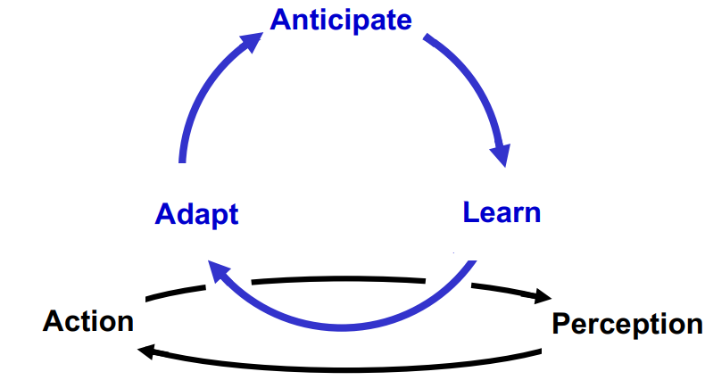
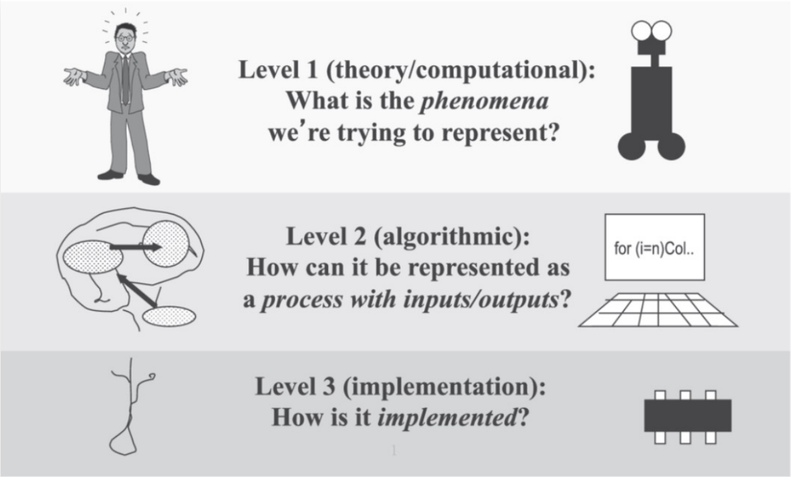

## What are Robots?

A `robot`, is a machine capable of carrying out a complex series of actions automatically, especially one programmable by a computer. Also, it could be described as an autonomous system which exists in the physical world, can sense its environment, and can act on it to achieve some goals. There are many types of robots that we define today. For example, they are:
- Humanoid
- Android
- Biomimetic
- Industrial (manipulation, navigation)
- Medical
- Assistive

### Humanoid Robots
A `humanoid robot` has an `anthropomorphic` body plan and actuators with `human-like senses` for human-robot interaction. For example, a `humanoid robot` could contains **a head, two legs, two arms and a torso**, and it contains **cameras, microphones, and touch sensors** to simulate humans' five senses. 

### Android Robots
An `android robot` is intentionally designed with the goal of being human-like and **indistinguishable from humans** in its external appearance and behavior, the difference between `android robots` and `humanoid robots` is that humanoid robots keeps the external appearance of a robot, which is distinguishable from human beings.

Note that there is a theory related to `android robots`, which is `uncanny valley`. It describes that humans affinity significantly reduced for robots that are similar but slightly different from real people. This is also the reason why we feeling scary to some human-like products. The following graph represents the `uncanny valley` in a data perspective.

### Biomimetic Robots
A `biomimetic robot` has an `animal-like` (humans, animals, plants) body plan and actuators, used to **exploit biological structures and mechanisms**.

### Industrial Robots (Manipulation & Navigation)
As the name describes, `industrial robots` are used in factories for manufacturing tasks, or, used for logistics centres, (semi)autonomous flying, and autonomous vehicles.

## What is Cognition?

`Cognition` is the process by which an `autonomous system` perceives its environment, learns from experience, anticipates the outcome of events, acts to pursue goals, and adapts to changing circumstances. The `cognition` could be defined as many stages, the following image could describe cognition by a cycle of `anticipation`:

If we want to develop some cognitive robotics robots, we have to make some sense of abstraction, for example, an abstraction of movement, because we can not abstract everything. Here we have `Marr's Levels of Abstraction`, proposed by `David Marr`, is a framework for understanding how information processing systems, particularly in the context of vision and perception, operate at different levels of abstraction. There are three levels of abstraction, which are:
1. Computational / theory  
This is the highest level of Marr's framework, where we focuses on define the problem, arise questions like what should the system does and why does it does it.
2. Representation / algorithmic
This level mainly focuses on the specific methods and strategies for solving the problem, it also defines how the information processes in the system.
3. Implementation
This is the most concrete level in Marr's framework, it deals with physical realization of the system, including hardware, neural mechanisms, or any other physical substrate.

## What is cognitive robotics?

In definition, `cognitive robotics` combines insights and methods from AI, as well as `cognitive` and `biological` sciences, to perform the design of `sensorimotor` and `cognitive capabilities` in `intelligent robots`(Engineering approach to the design of intelligent capabilities
in robots using any Artificial Intelligence methods). For all the normal robots, it is easy if we `pre-programmed` the robots so they can memorize dictionaries and achieve some goal in communicating with human beings, however, they are **not able to understand the language** they use.

Here we also have a definition for `artificial cognitive systems`, as it is use to design a cognitive robotics robot, by using the modelling of simulated and embodied/robotic agents taking inspiration from natural and cognitive systems.